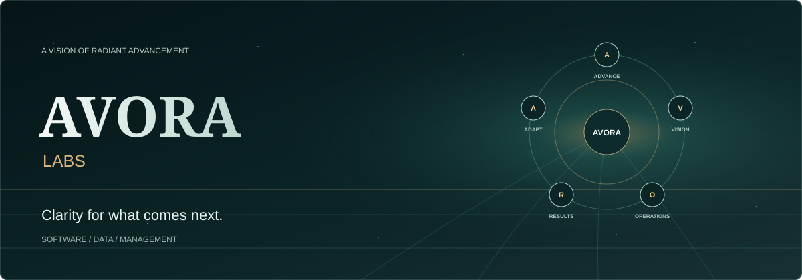

# AVORA Labs

**Clarity for what comes next.**

Software &nbsp; / &nbsp; Data &nbsp; / &nbsp; Management

[**VI · Tiếng Việt**](#tieng-viet) &nbsp; | &nbsp; [**EN · English**](#english)

## Tạo ra sự rõ ràng cho doanh nghiệp.

Chúng tôi là **AVORA Labs**, một đội ngũ tại Việt Nam tập trung xây dựng giải pháp phần mềm, dữ liệu và quản lý. Công nghệ tốt bắt đầu từ việc hiểu con người và cách họ làm việc: kết nối thông tin, gỡ bỏ sự phức tạp và giúp mỗi quyết định có cơ sở hơn.

### AVORA có nghĩa là gì?

AVORA là tên riêng gợi về **ánh bình minh, tầm nhìn và sự tiến về phía trước** — _A Vision of Radiant Advancement_. Với chúng tôi, tên gọi còn đại diện cho năm năng lực:

**A · Advance** — Tiến về phía trước &nbsp; **V · Vision** — Nhìn rõ hướng đi &nbsp; **O · Operations** — Vận hành có hệ thống &nbsp; **R · Results** — Tạo ra kết quả &nbsp; **A · Adapt** — Thích nghi để phát triển

**01 / Phần mềm** · Công cụ được thiết kế quanh nhu cầu và quy trình thực tế.

**02 / Dữ liệu** · Kết nối thông tin để nhìn rõ và quyết định tốt hơn.

**03 / Quản lý** · Hệ thống giúp con người và hoạt động phối hợp nhịp nhàng.

> Hiểu vấn đề trước. Thiết kế có chủ đích. Xây dựng để thích nghi.

## Technology that brings clarity to business.

We are **AVORA Labs**, a team in Vietnam focused on software, data, and management solutions. Good technology starts with understanding people and how they work: connecting information, reducing complexity, and helping businesses make better-informed decisions.

### What does AVORA mean?

AVORA is a distinctive name inspired by **a new dawn, clear vision, and forward motion** — _A Vision of Radiant Advancement_. It also represents five capabilities:

**A · Advance** — Move forward &nbsp; **V · Vision** — See the direction clearly &nbsp; **O · Operations** — Operate as a system &nbsp; **R · Results** — Create meaningful results &nbsp; **A · Adapt** — Adapt to keep growing

**01 / Software** · Tools designed around real needs and workflows.

**02 / Data** · Connected information for clearer, better-informed decisions.

**03 / Management** · Systems that help people and operations work together.

> Understand first. Design with intent. Build to adapt.

---

  <strong>AVORA Labs · Vietnam</strong> 
  <a href="https://github.com/AVORA-Labs">GitHub ↗</a>

